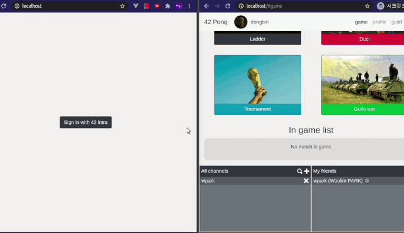

# ft_transcendence (42 Pong)
<div style="text-align:center">
	
</div>

## Overview
`ft_transcendence` is the last common core project of école 42. The superficial purpose of this project is to implement a real-time online pong contest website with `ruby on rails`, `backbone.js`, and `postgreSQL`, but <b>the real purpose is to create something you've never done before with a language you've never used and a framework you've never experienced before</b>.

This 42 Pong support realtime game, chat, group chat channel, friend's online-offline status, guild, guild war, ranking system and tournament. All layouts are fully responsive.

For more details, please read subject file `en.subject.pdf`.

## How to launch
For lanching our website, just enter the command below.
```
docker-compose up --build
```

To access `42pong` site, go to localhost 
```
http://127.0.0.1
```

To access `pgadmin` site, use to 8080 port of localhost.
```
// pgadmin id : admin@admin.com, password : admin
// db user : postgres, password : postgres
http://127.0.0.1:8080 
```

## How to login
1. Login with 42 intranet id

	just click the button `login with 42`, then it will redirect you to 42 Oauth login page.

2. Login with database id and password

	For those who do not have an 42 intranet ID, we have created a backdoor login page.
	```
	http://127.0.0.1/users/sign_in
	```

	These are the list of dummy user email ids. You can use one of these for login.
	password is always `asdfas`.
	```
	doby@asdf.com
	jai@asdf.com
	salty@asdf.com
	noich@asdf.com
	benny@asdf.com
	sophie@asdf.com
	ol@asdf.com
	snow@asdf.com
	jerry@asdf.com
	charly@adf.com
	```

	If you want to see admin page, login with email `wpark@student.42.fr`

## Contributer
* <a href="https://github.com/mohit-ashar">Mohit Ashar(mashar)</a>
* <a href="https://github.com/pvineet44">Vineet Parekh(vparekh)</a> 
* <a href="https://github.com/nicokla">Nicolas Klarsfeld(nklarsfe)</a>
* <a href="https://github.com/woolimi">Woolim Park(wpark)</a>

## Resources
* [Subject link(en)](https://cdn.intra.42.fr/pdf/pdf/10740/en.subject.pdf)
* [Ruby on rails guide(ko)](https://rubykr.github.io/rails_guides/getting_started.html)
* [Ruby on rails guide(en)](https://guides.rubyonrails.org/getting_started.html)
* [Backbone js official homepage en](https://backbonejs.org/)
* [setup ruby on rails 6 with docker-compose](https://yizeng.me/2019/11/09/setup-a-ruby-on-rails-6-api-project-with-docker-compose/)
* [Go rails](https://gorails.com/episodes)
* [Learn backbone.js from scratch](https://www.youtube.com/watch?v=HOAU-nfy5Sc)
